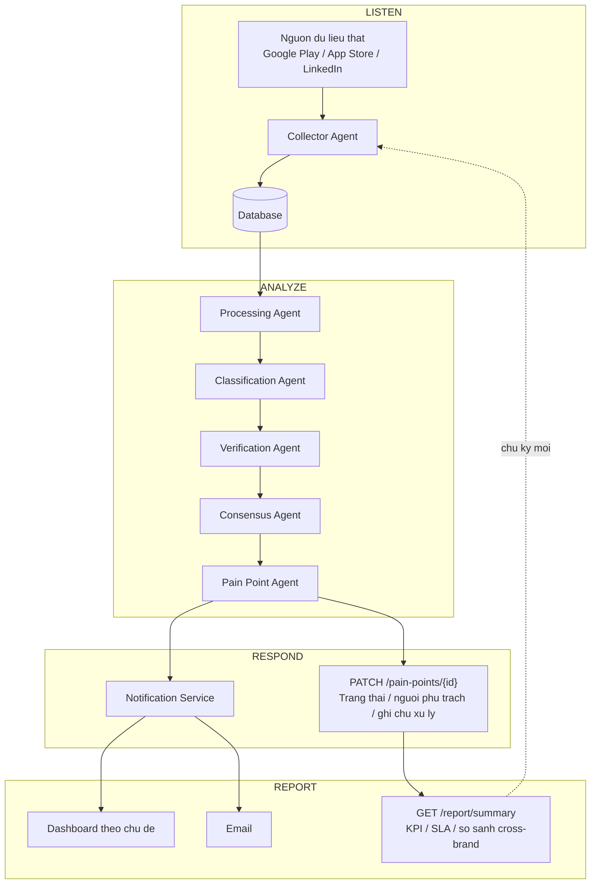

# Kien truc he thong (chuan SMCC: Listen -> Analyze -> Respond -> Report)

Chu ky Listen->Analyze: 15-30 phut/lan (near real-time) - xem PRD muc 10.
Respond/Report la lop nghiep vu con nguoi thao tac tren ket qua pipeline
(khong phai mot Agent), xem PRD muc 10 va `src/api/routes.py`.

## LangGraph state graph

`src/agents/graph.py` bien luong tren thanh mot `StateGraph` voi state schema
dinh nghia trong `src/agents/state.py`. Moi node tuong ung mot agent, nhan va
tra ve mot phan cua `AgentState`.
