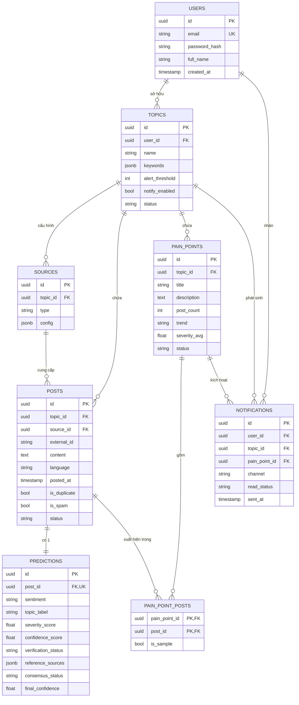

# ERD và Định nghĩa khóa ngoại

## Chi tiết cho mục 0.2 (Phase 0 – Chuẩn bị và thiết kế nền tảng)

Stack đã chọn ở tài liệu trước: PostgreSQL + Python (SQLAlchemy) + Alembic cho migration. ERD dưới đây thể hiện toàn bộ 7 bảng theo PRD, cộng thêm một bảng trung gian `PainPointPosts` để xử lý quan hệ nhiều-nhiều giữa Posts và PainPoints (một post có thể thuộc nhiều pain point theo thời gian, một pain point gồm nhiều post).

Sơ đồ trực quan (bốn bảng trọng tâm Topics–Posts–Predictions–PainPoints) đã hiển thị trong hội thoại dạng SVG. Bản đầy đủ 8 bảng dưới đây dùng Mermaid để lưu trong tài liệu.



---

## Định nghĩa khóa ngoại — trọng tâm Posts / Predictions / PainPoints / Topics

| Bảng con (FK)       | Cột              | Bảng cha (tham chiếu) | Ràng buộc                            | ON DELETE | Lý do                                                                                                                                                                                                                                            |
| -------------------- | ----------------- | ----------------------- | -------------------------------------- | --------- | ------------------------------------------------------------------------------------------------------------------------------------------------------------------------------------------------------------------------------------------------- |
| `posts`            | `topic_id`      | `topics.id`           | NOT NULL                               | CASCADE   | Post luôn thuộc một topic; xóa topic thì xóa toàn bộ post đã thu thập cho topic đó (dữ liệu không còn ý nghĩa khi không còn topic theo dõi).                                                                                |
| `posts`            | `source_id`     | `sources.id`          | NULLABLE                               | SET NULL  | Nếu xóa cấu hình nguồn, post đã thu thập vẫn giữ lại để không mất dữ liệu lịch sử, chỉ mất liên kết tới cấu hình nguồn.                                                                                                |
| `predictions`      | `post_id`       | `posts.id`            | NOT NULL,**UNIQUE**              | CASCADE   | Quan hệ 1–1: mỗi post có đúng một bản ghi prediction (được Classification/Verification/Consensus Agent cùng cập nhật dần).`UNIQUE` đảm bảo không tạo trùng prediction cho một post. Xóa post thì xóa luôn prediction. |
| `pain_points`      | `topic_id`      | `topics.id`           | NOT NULL                               | CASCADE   | Pain point luôn gắn với một topic cụ thể, tương tự posts.                                                                                                                                                                                |
| `pain_point_posts` | `pain_point_id` | `pain_points.id`      | NOT NULL, một phần khóa chính kép | CASCADE   | Bảng trung gian cho quan hệ N–N giữa Posts và PainPoints.                                                                                                                                                                                    |
| `pain_point_posts` | `post_id`       | `posts.id`            | NOT NULL, một phần khóa chính kép | CASCADE   | —                                                                                                                                                                                                                                                |
| `topics`           | `user_id`       | `users.id`            | NOT NULL                               | CASCADE   | Topic luôn thuộc một người dùng; xóa tài khoản thì xóa các topic của họ (theo mô hình workspace riêng từng user ở PRD mục 11).                                                                                                |
| `notifications`    | `pain_point_id` | `pain_points.id`      | NOT NULL                               | CASCADE   | Thông báo luôn gắn với một pain point cụ thể đã sinh ra nó.                                                                                                                                                                            |

Ràng buộc bổ sung quan trọng:

- `posts (source_id, external_id)` — `UNIQUE` — chống trùng lặp ở tầng DB, không chỉ dựa vào Processing Agent (phòng trường hợp agent lỗi vẫn insert trùng).
- `predictions (post_id)` — `UNIQUE` — ép quan hệ 1–1 giữa Posts và Predictions đúng như contract JSON đã định nghĩa ở tài liệu trước (Classification/Verification/Consensus Agent cùng ghi vào một bản ghi duy nhất).
- `pain_point_posts (pain_point_id, post_id)` — khóa chính kép (composite primary key) — một post chỉ xuất hiện một lần trong một pain point.

---

## Migration script (Alembic)

Hai file dưới đây giả định đã chạy `alembic init migrations` trong project và cấu hình `env.py` trỏ tới `Base.metadata` của SQLAlchemy models.

### `models.py`

```python
import uuid
from datetime import datetime

from sqlalchemy import (
    Boolean,
    Column,
    DateTime,
    Enum,
    Float,
    ForeignKey,
    Integer,
    String,
    Text,
    UniqueConstraint,
)
from sqlalchemy.dialects.postgresql import JSONB, UUID
from sqlalchemy.orm import declarative_base, relationship

Base = declarative_base()


def gen_uuid():
    return uuid.uuid4()


class User(Base):
    __tablename__ = "users"

    id = Column(UUID(as_uuid=True), primary_key=True, default=gen_uuid)
    email = Column(String(255), unique=True, nullable=False, index=True)
    password_hash = Column(String(255), nullable=False)
    full_name = Column(String(255), nullable=True)
    created_at = Column(DateTime(timezone=True), default=datetime.utcnow)
    updated_at = Column(DateTime(timezone=True), default=datetime.utcnow, onupdate=datetime.utcnow)

    topics = relationship("Topic", back_populates="user", cascade="all, delete-orphan")
    notifications = relationship("Notification", back_populates="user", cascade="all, delete-orphan")


class Topic(Base):
    __tablename__ = "topics"

    id = Column(UUID(as_uuid=True), primary_key=True, default=gen_uuid)
    user_id = Column(UUID(as_uuid=True), ForeignKey("users.id", ondelete="CASCADE"), nullable=False, index=True)
    name = Column(String(255), nullable=False)
    keywords = Column(JSONB, nullable=False, default=list)
    alert_threshold = Column(Integer, nullable=False, default=10)
    notify_enabled = Column(Boolean, nullable=False, default=True)
    status = Column(Enum("active", "archived", name="topic_status"), nullable=False, default="active")
    created_at = Column(DateTime(timezone=True), default=datetime.utcnow)
    updated_at = Column(DateTime(timezone=True), default=datetime.utcnow, onupdate=datetime.utcnow)

    user = relationship("User", back_populates="topics")
    sources = relationship("Source", back_populates="topic", cascade="all, delete-orphan")
    posts = relationship("Post", back_populates="topic", cascade="all, delete-orphan")
    pain_points = relationship("PainPoint", back_populates="topic", cascade="all, delete-orphan")
    notifications = relationship("Notification", back_populates="topic", cascade="all, delete-orphan")


class Source(Base):
    __tablename__ = "sources"

    id = Column(UUID(as_uuid=True), primary_key=True, default=gen_uuid)
    topic_id = Column(UUID(as_uuid=True), ForeignKey("topics.id", ondelete="CASCADE"), nullable=False, index=True)
    type = Column(Enum("google_play", "app_store", "linkedin", name="source_type"), nullable=False)
    config = Column(JSONB, nullable=False, default=dict)
    created_at = Column(DateTime(timezone=True), default=datetime.utcnow)

    topic = relationship("Topic", back_populates="sources")
    posts = relationship("Post", back_populates="source")


class Post(Base):
    __tablename__ = "posts"
    __table_args__ = (UniqueConstraint("source_id", "external_id", name="uq_posts_source_external_id"),)

    id = Column(UUID(as_uuid=True), primary_key=True, default=gen_uuid)
    topic_id = Column(UUID(as_uuid=True), ForeignKey("topics.id", ondelete="CASCADE"), nullable=False, index=True)
    source_id = Column(UUID(as_uuid=True), ForeignKey("sources.id", ondelete="SET NULL"), nullable=True, index=True)
    external_id = Column(String(255), nullable=True)
    raw_content = Column(Text, nullable=True)
    content = Column(Text, nullable=True)
    language = Column(String(10), nullable=False, default="vi")
    posted_at = Column(DateTime(timezone=True), nullable=True)
    collected_at = Column(DateTime(timezone=True), default=datetime.utcnow)
    is_duplicate = Column(Boolean, nullable=False, default=False)
    is_spam = Column(Boolean, nullable=False, default=False)
    status = Column(Enum("raw", "cleaned", name="post_status"), nullable=False, default="raw")
    created_at = Column(DateTime(timezone=True), default=datetime.utcnow)
    updated_at = Column(DateTime(timezone=True), default=datetime.utcnow, onupdate=datetime.utcnow)

    topic = relationship("Topic", back_populates="posts")
    source = relationship("Source", back_populates="posts")
    prediction = relationship("Prediction", back_populates="post", uselist=False, cascade="all, delete-orphan")
    pain_point_links = relationship("PainPointPost", back_populates="post", cascade="all, delete-orphan")


class Prediction(Base):
    __tablename__ = "predictions"

    id = Column(UUID(as_uuid=True), primary_key=True, default=gen_uuid)
    post_id = Column(UUID(as_uuid=True), ForeignKey("posts.id", ondelete="CASCADE"), nullable=False, unique=True)

    # Classification Agent
    sentiment = Column(Enum("positive", "neutral", "negative", name="sentiment_type"), nullable=True)
    topic_label = Column(String(50), nullable=True)
    severity_score = Column(Float, nullable=True)
    confidence_score = Column(Float, nullable=True)
    model_version = Column(String(50), nullable=True)
    classified_at = Column(DateTime(timezone=True), nullable=True)

    # Verification Agent
    verification_status = Column(Enum("verified", "unverified", "conflicting", name="verification_status_type"), nullable=True)
    reference_sources = Column(JSONB, nullable=False, default=list)
    verification_confidence = Column(Float, nullable=True)
    verified_at = Column(DateTime(timezone=True), nullable=True)

    # Consensus Agent
    consensus_status = Column(Enum("confirmed", "needs_review", "dismissed", name="consensus_status_type"), nullable=True)
    final_confidence = Column(Float, nullable=True)
    reasoning = Column(Text, nullable=True)
    consensus_at = Column(DateTime(timezone=True), nullable=True)

    created_at = Column(DateTime(timezone=True), default=datetime.utcnow)
    updated_at = Column(DateTime(timezone=True), default=datetime.utcnow, onupdate=datetime.utcnow)

    post = relationship("Post", back_populates="prediction")


class PainPoint(Base):
    __tablename__ = "pain_points"

    id = Column(UUID(as_uuid=True), primary_key=True, default=gen_uuid)
    topic_id = Column(UUID(as_uuid=True), ForeignKey("topics.id", ondelete="CASCADE"), nullable=False, index=True)
    title = Column(String(255), nullable=False)
    description = Column(Text, nullable=True)
    post_count = Column(Integer, nullable=False, default=0)
    trend = Column(Enum("increasing", "stable", "decreasing", name="trend_type"), nullable=True)
    sources = Column(JSONB, nullable=False, default=list)
    severity_avg = Column(Float, nullable=True)
    confidence_avg = Column(Float, nullable=True)
    status = Column(Enum("unverified", "verified", "needs_review", name="painpoint_status"), nullable=False, default="unverified")
    created_at = Column(DateTime(timezone=True), default=datetime.utcnow)
    updated_at = Column(DateTime(timezone=True), default=datetime.utcnow, onupdate=datetime.utcnow)

    topic = relationship("Topic", back_populates="pain_points")
    post_links = relationship("PainPointPost", back_populates="pain_point", cascade="all, delete-orphan")
    notifications = relationship("Notification", back_populates="pain_point", cascade="all, delete-orphan")


class PainPointPost(Base):
    """Bảng trung gian N-N giữa PainPoints và Posts."""

    __tablename__ = "pain_point_posts"

    pain_point_id = Column(UUID(as_uuid=True), ForeignKey("pain_points.id", ondelete="CASCADE"), primary_key=True)
    post_id = Column(UUID(as_uuid=True), ForeignKey("posts.id", ondelete="CASCADE"), primary_key=True)
    is_sample = Column(Boolean, nullable=False, default=False)

    pain_point = relationship("PainPoint", back_populates="post_links")
    post = relationship("Post", back_populates="pain_point_links")


class Notification(Base):
    __tablename__ = "notifications"

    id = Column(UUID(as_uuid=True), primary_key=True, default=gen_uuid)
    user_id = Column(UUID(as_uuid=True), ForeignKey("users.id", ondelete="CASCADE"), nullable=False, index=True)
    topic_id = Column(UUID(as_uuid=True), ForeignKey("topics.id", ondelete="CASCADE"), nullable=False, index=True)
    pain_point_id = Column(UUID(as_uuid=True), ForeignKey("pain_points.id", ondelete="CASCADE"), nullable=False, index=True)
    channel = Column(Enum("email", "web", "both", name="notification_channel"), nullable=False)
    severity = Column(Float, nullable=True)
    message = Column(Text, nullable=True)
    sent_at = Column(DateTime(timezone=True), default=datetime.utcnow)
    read_status = Column(Enum("unread", "read", name="read_status_type"), nullable=False, default="unread")

    user = relationship("User", back_populates="notifications")
    topic = relationship("Topic", back_populates="notifications")
    pain_point = relationship("PainPoint", back_populates="notifications")
```

### `migrations/versions/0001_initial_schema.py`

```python
"""initial schema: users, topics, sources, posts, predictions, pain_points, pain_point_posts, notifications

Revision ID: 0001
Revises:
Create Date: 2026-08-05
"""
from alembic import op
import sqlalchemy as sa
from sqlalchemy.dialects import postgresql

revision = "0001"
down_revision = None
branch_labels = None
depends_on = None


def upgrade():
    op.execute('CREATE EXTENSION IF NOT EXISTS "pgcrypto"')  # cho gen_random_uuid()

    op.create_table(
        "users",
        sa.Column("id", postgresql.UUID(as_uuid=True), primary_key=True, server_default=sa.text("gen_random_uuid()")),
        sa.Column("email", sa.String(255), nullable=False, unique=True),
        sa.Column("password_hash", sa.String(255), nullable=False),
        sa.Column("full_name", sa.String(255), nullable=True),
        sa.Column("created_at", sa.DateTime(timezone=True), server_default=sa.text("now()")),
        sa.Column("updated_at", sa.DateTime(timezone=True), server_default=sa.text("now()")),
    )

    op.create_table(
        "topics",
        sa.Column("id", postgresql.UUID(as_uuid=True), primary_key=True, server_default=sa.text("gen_random_uuid()")),
        sa.Column("user_id", postgresql.UUID(as_uuid=True), sa.ForeignKey("users.id", ondelete="CASCADE"), nullable=False),
        sa.Column("name", sa.String(255), nullable=False),
        sa.Column("keywords", postgresql.JSONB, nullable=False, server_default="[]"),
        sa.Column("alert_threshold", sa.Integer, nullable=False, server_default="10"),
        sa.Column("notify_enabled", sa.Boolean, nullable=False, server_default=sa.text("true")),
        sa.Column("status", sa.Enum("active", "archived", name="topic_status"), nullable=False, server_default="active"),
        sa.Column("created_at", sa.DateTime(timezone=True), server_default=sa.text("now()")),
        sa.Column("updated_at", sa.DateTime(timezone=True), server_default=sa.text("now()")),
    )
    op.create_index("ix_topics_user_id", "topics", ["user_id"])

    op.create_table(
        "sources",
        sa.Column("id", postgresql.UUID(as_uuid=True), primary_key=True, server_default=sa.text("gen_random_uuid()")),
        sa.Column("topic_id", postgresql.UUID(as_uuid=True), sa.ForeignKey("topics.id", ondelete="CASCADE"), nullable=False),
        sa.Column("type", sa.Enum("google_play", "app_store", "linkedin", name="source_type"), nullable=False),
        sa.Column("config", postgresql.JSONB, nullable=False, server_default="{}"),
        sa.Column("created_at", sa.DateTime(timezone=True), server_default=sa.text("now()")),
    )
    op.create_index("ix_sources_topic_id", "sources", ["topic_id"])

    op.create_table(
        "posts",
        sa.Column("id", postgresql.UUID(as_uuid=True), primary_key=True, server_default=sa.text("gen_random_uuid()")),
        sa.Column("topic_id", postgresql.UUID(as_uuid=True), sa.ForeignKey("topics.id", ondelete="CASCADE"), nullable=False),
        sa.Column("source_id", postgresql.UUID(as_uuid=True), sa.ForeignKey("sources.id", ondelete="SET NULL"), nullable=True),
        sa.Column("external_id", sa.String(255), nullable=True),
        sa.Column("raw_content", sa.Text, nullable=True),
        sa.Column("content", sa.Text, nullable=True),
        sa.Column("language", sa.String(10), nullable=False, server_default="vi"),
        sa.Column("posted_at", sa.DateTime(timezone=True), nullable=True),
        sa.Column("collected_at", sa.DateTime(timezone=True), server_default=sa.text("now()")),
        sa.Column("is_duplicate", sa.Boolean, nullable=False, server_default=sa.text("false")),
        sa.Column("is_spam", sa.Boolean, nullable=False, server_default=sa.text("false")),
        sa.Column("status", sa.Enum("raw", "cleaned", name="post_status"), nullable=False, server_default="raw"),
        sa.Column("created_at", sa.DateTime(timezone=True), server_default=sa.text("now()")),
        sa.Column("updated_at", sa.DateTime(timezone=True), server_default=sa.text("now()")),
        sa.UniqueConstraint("source_id", "external_id", name="uq_posts_source_external_id"),
    )
    op.create_index("ix_posts_topic_id", "posts", ["topic_id"])
    op.create_index("ix_posts_source_id", "posts", ["source_id"])

    op.create_table(
        "predictions",
        sa.Column("id", postgresql.UUID(as_uuid=True), primary_key=True, server_default=sa.text("gen_random_uuid()")),
        sa.Column("post_id", postgresql.UUID(as_uuid=True), sa.ForeignKey("posts.id", ondelete="CASCADE"), nullable=False, unique=True),
        sa.Column("sentiment", sa.Enum("positive", "neutral", "negative", name="sentiment_type"), nullable=True),
        sa.Column("topic_label", sa.String(50), nullable=True),
        sa.Column("severity_score", sa.Float, nullable=True),
        sa.Column("confidence_score", sa.Float, nullable=True),
        sa.Column("model_version", sa.String(50), nullable=True),
        sa.Column("classified_at", sa.DateTime(timezone=True), nullable=True),
        sa.Column("verification_status", sa.Enum("verified", "unverified", "conflicting", name="verification_status_type"), nullable=True),
        sa.Column("reference_sources", postgresql.JSONB, nullable=False, server_default="[]"),
        sa.Column("verification_confidence", sa.Float, nullable=True),
        sa.Column("verified_at", sa.DateTime(timezone=True), nullable=True),
        sa.Column("consensus_status", sa.Enum("confirmed", "needs_review", "dismissed", name="consensus_status_type"), nullable=True),
        sa.Column("final_confidence", sa.Float, nullable=True),
        sa.Column("reasoning", sa.Text, nullable=True),
        sa.Column("consensus_at", sa.DateTime(timezone=True), nullable=True),
        sa.Column("created_at", sa.DateTime(timezone=True), server_default=sa.text("now()")),
        sa.Column("updated_at", sa.DateTime(timezone=True), server_default=sa.text("now()")),
    )

    op.create_table(
        "pain_points",
        sa.Column("id", postgresql.UUID(as_uuid=True), primary_key=True, server_default=sa.text("gen_random_uuid()")),
        sa.Column("topic_id", postgresql.UUID(as_uuid=True), sa.ForeignKey("topics.id", ondelete="CASCADE"), nullable=False),
        sa.Column("title", sa.String(255), nullable=False),
        sa.Column("description", sa.Text, nullable=True),
        sa.Column("post_count", sa.Integer, nullable=False, server_default="0"),
        sa.Column("trend", sa.Enum("increasing", "stable", "decreasing", name="trend_type"), nullable=True),
        sa.Column("sources", postgresql.JSONB, nullable=False, server_default="[]"),
        sa.Column("severity_avg", sa.Float, nullable=True),
        sa.Column("confidence_avg", sa.Float, nullable=True),
        sa.Column("status", sa.Enum("unverified", "verified", "needs_review", name="painpoint_status"), nullable=False, server_default="unverified"),
        sa.Column("created_at", sa.DateTime(timezone=True), server_default=sa.text("now()")),
        sa.Column("updated_at", sa.DateTime(timezone=True), server_default=sa.text("now()")),
    )
    op.create_index("ix_pain_points_topic_id", "pain_points", ["topic_id"])

    op.create_table(
        "pain_point_posts",
        sa.Column("pain_point_id", postgresql.UUID(as_uuid=True), sa.ForeignKey("pain_points.id", ondelete="CASCADE"), primary_key=True),
        sa.Column("post_id", postgresql.UUID(as_uuid=True), sa.ForeignKey("posts.id", ondelete="CASCADE"), primary_key=True),
        sa.Column("is_sample", sa.Boolean, nullable=False, server_default=sa.text("false")),
    )

    op.create_table(
        "notifications",
        sa.Column("id", postgresql.UUID(as_uuid=True), primary_key=True, server_default=sa.text("gen_random_uuid()")),
        sa.Column("user_id", postgresql.UUID(as_uuid=True), sa.ForeignKey("users.id", ondelete="CASCADE"), nullable=False),
        sa.Column("topic_id", postgresql.UUID(as_uuid=True), sa.ForeignKey("topics.id", ondelete="CASCADE"), nullable=False),
        sa.Column("pain_point_id", postgresql.UUID(as_uuid=True), sa.ForeignKey("pain_points.id", ondelete="CASCADE"), nullable=False),
        sa.Column("channel", sa.Enum("email", "web", "both", name="notification_channel"), nullable=False),
        sa.Column("severity", sa.Float, nullable=True),
        sa.Column("message", sa.Text, nullable=True),
        sa.Column("sent_at", sa.DateTime(timezone=True), server_default=sa.text("now()")),
        sa.Column("read_status", sa.Enum("unread", "read", name="read_status_type"), nullable=False, server_default="unread"),
    )
    op.create_index("ix_notifications_user_id", "notifications", ["user_id"])
    op.create_index("ix_notifications_topic_id", "notifications", ["topic_id"])
    op.create_index("ix_notifications_pain_point_id", "notifications", ["pain_point_id"])


def downgrade():
    op.drop_table("notifications")
    op.drop_table("pain_point_posts")
    op.drop_table("pain_points")
    op.drop_table("predictions")
    op.drop_table("posts")
    op.drop_table("sources")
    op.drop_table("topics")
    op.drop_table("users")

    for enum_name in [
        "topic_status", "source_type", "post_status", "sentiment_type",
        "verification_status_type", "consensus_status_type", "trend_type",
        "painpoint_status", "notification_channel", "read_status_type",
    ]:
        op.execute(f"DROP TYPE IF EXISTS {enum_name}")
```

Thứ tự tạo bảng trong `upgrade()` tuân theo đúng thứ tự phụ thuộc khóa ngoại: `users` → `topics` → `sources` → `posts` → `predictions` → `pain_points` → `pain_point_posts` → `notifications`. `downgrade()` xóa theo thứ tự ngược lại để không vi phạm ràng buộc FK.

### Cách chạy

```bash
pip install alembic sqlalchemy psycopg2-binary
alembic init migrations
# copy nội dung migration ở trên vào migrations/versions/0001_initial_schema.py
# trỏ target_metadata = Base.metadata trong migrations/env.py
alembic upgrade head
```

### Cách test (nối tiếp nguyên tắc test đã định nghĩa trước)

- Chạy `alembic upgrade head` trên DB rỗng, xác nhận cả 8 bảng và 10 enum type được tạo không lỗi.
- Thử insert một `Post` với `topic_id` không tồn tại — xác nhận DB từ chối (vi phạm FK).
- Thử insert 2 `Prediction` cùng `post_id` — xác nhận DB từ chối (vi phạm UNIQUE).
- Thử insert `Post` trùng `(source_id, external_id)` — xác nhận DB từ chối (chống trùng lặp).
- Xóa một `Topic` có sẵn `Posts`/`PainPoints`/`Sources` liên quan — xác nhận cascade xóa đúng theo bảng ON DELETE ở trên.
- Chạy `alembic downgrade base` rồi `alembic upgrade head` lại để xác nhận migration có thể lặp lại (idempotent trong quy trình CI).

---

## Ghi chú triển khai (Phase 1)

Phần code thực tế (SQLAlchemy models, Alembic migration, Collector Agent, Processing Agent, scheduler) được triển khai trong `src/db/`, `migrations/`, và `src/pipeline/` — xem [ARCHITECTURE.md](../../ARCHITECTURE.md) và mã nguồn để biết chi tiết cập nhật so với bản thiết kế gốc ở trên (ví dụ: `posts` có thêm cột `raw_content`/`collected_at` để Processing Agent lưu bản gốc trước khi làm sạch).
